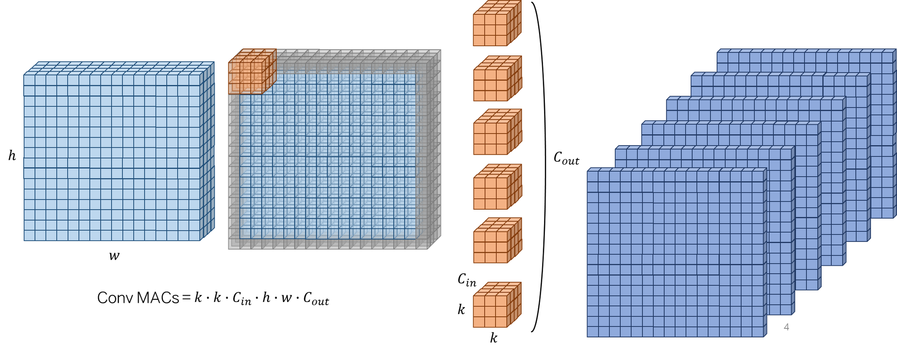
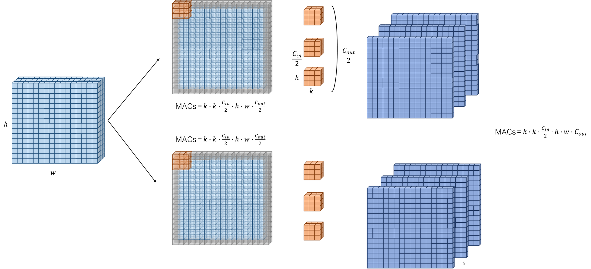
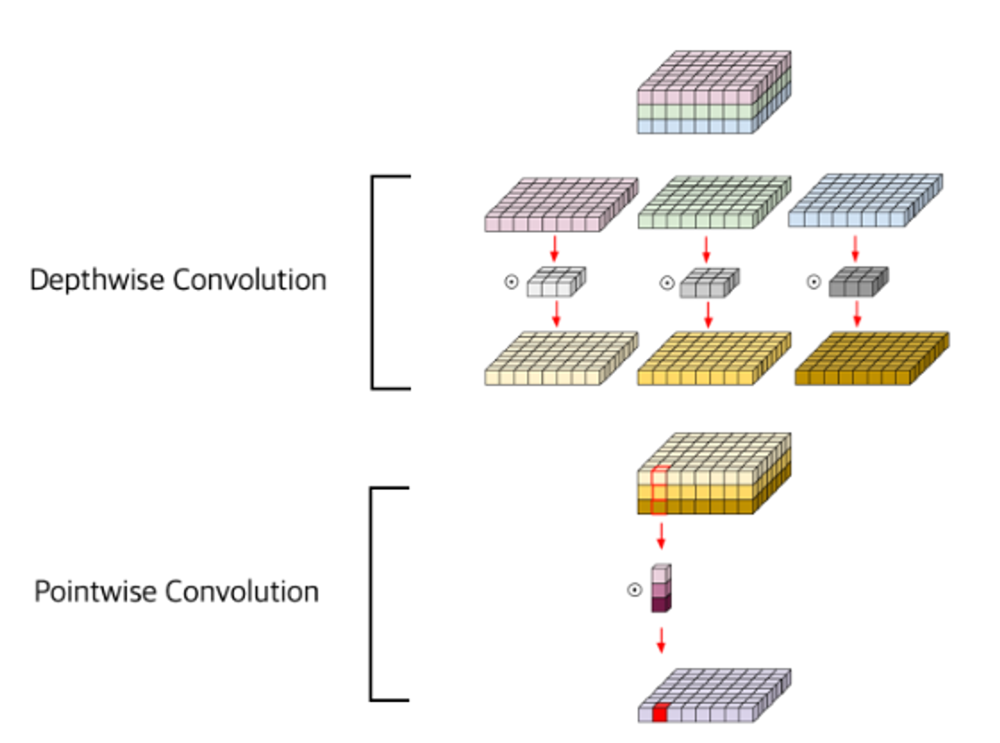

# MobileNets: Efficient Convolutional Neural Networks for Mobile Vision Applications

## Summary
1. 깊은 네트워크는 성능이 좋지만 효율적이지 않다.
2. 일반적인 conovolution layer를 depthwise seperable convolution(depthwise convolution & pointwise convoltuion)으로 
나누면 크게 줄일수있다.

* [Mindmap]()
* MACs (Multiply-ACcumulate operations) of convolution layer 

  - h : feature map height
  - w : feature map width
  - k : kernel size
  - C_in : input channels
  - C_out : output channels

* MACs of group convolution layer MACs 

  - $MACs = \frac{k \times k \times C_{in} \times h \times w \times C_{out}}{g}$
  - 따라서 group convolution은 standard convolution에 비해 계산량이 1/g 배로 감소하는 것을 알 수 있다.

* Depthwise seperable convolution

