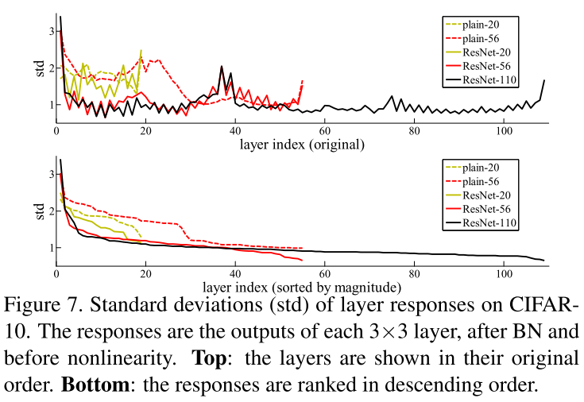
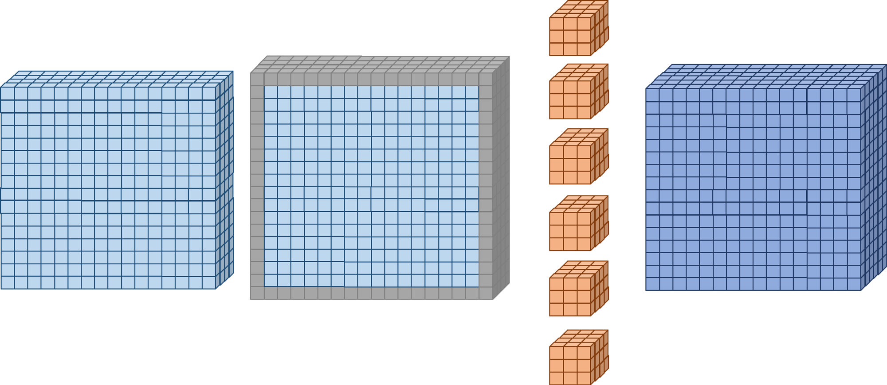

# Deep Residual Learning for Image Recognition

## Summary
1. 네트워크는 깊을수록 성능이 좋다.
2. 깊으면 vanishing/exploding gradient가 발생하여 수렴(Convergence)하기 어렵다.
    → normalization, SGD로 해결 가능
3. 깊으면 수렴하지만 degradation이 발생하는 문제 발생
    → overfitting 문제는 아니다 (training error와 validation error가 모두 감소하기 때문)
    → 학습이 어렵기 때문이지 않을까?
4. shallow vs deep network 비교했을 때 만약 deep network가 shallow network에서 단순히 identity mapping만 추가된다면 
최소 shallow network와 성능이 같거나 높아야하는데 실험 결과 그렇지 않다.
5. 이러한 실험 결과는 identity mapping에 대해서 학습이 어렵기 때문이다. (H(x) → x) nonlinearity를 가지는 layer를 지났는데도 
입력과 같아지는 것은 힘들기 때문
6. F(x) + x → x 로 shortcut connection을 추가하면 F(x)의 weight를 0으로 만드는 방식으로 학습을 하면 identity mapping이 가능하여
쉽게 학습이 가능하다.
7. 실제로 identity mapping이 network에 필요한가에 대한 의문은 layer response 실험을 통해 F(x)가 0에 가깝게 학습이 된다는 것으로 입증

## Q&A
1. Analysis of Layer Responses 질문

   

   1. Analysis of Layer Responses에서 std이 작다는 것이 왜 residual function이 0에 가까워지는 것과 연관이 되는지?
        * 전체 response와 해당 layer의 response를 비교했을 때 std가 작다면 전반적인 layer의 response와 그 편차가 크지 않다는 말이기 
        때문이다.
        * $x_i+ F_i(x)=x_{i+1}$, $F_i(x)\rightarrow C_i$, then $F_i(x)\rightarrow C_i$
        * $x_{i+1} + F_{i+1} = x_{i+2}$, $F_{i+1}(x)\rightarrow C_{i+1}$, 
        then $x_{i+2}= x_{i+1} + C_{i+1} = x_{i} + C_i + C_{i+1}$
   
   2. std가 마지막 index layer에서 커지는 이유가 무엇인가요?
        * 마지막 layer는 classfication을 위한 layer로 역할이 다르기 때문으로 추정

2. x → H(x) 라는 identity function으로 입력과 출력이 같아야하는 경우가 있는지? (왜 굳이 identity mapping으로 이를 보여주는지?)

   * *"There exists a solution by construction to the deeper model: the added layers are identity mapping,
        and the other layers are copied from the learned shallower model. The existence of this constructed solution 
        indicates that a deeper model should produce no higher training error than its shallower counterpart."*
     * deep network는 shallow network보다 error가 높으면 안된다. 왜나햐면 deep network가 shallow network에서 layer를 몇 개 
        더 쌓는다고 했을 때, 이미 shallow network에서 가진 출력이 optimal 하다면 그 뒤 layer는 단순히 identity하게 입력과 출력이
        같도록 하는 layer로 기능을하여 가장 마지막 출력으로 넘겨주기만해도 shallow network보다 error가 떨어지지는 않을 것이기 때문이다.
        ⇒ identity mapping을 예시로 설명한 이유
   * *"In real cases, it is unlikely that identity mappings are optimal, but our reformulation may help to precondition 
     the problem. If the optimal function is closer to an identity mapping than to a zero mapping, 
     it should be easier for the solver to find the perturbations with reference to an identity mapping, 
     than to learn the function as a new one. We show by experiments (Fig. 7) that the learned residual functions 
     in general have small responses, suggesting that identity mappings provide reasonable preconditioning."*
     * 실제에서는 identity mapping을 하는 layer로 동작하는 것이 최적인 경우가 드물겠지만, 문제를 해결하는 전제 조건을 도와준다. 
     → 만약에 identity mapping이 최적일 때 도움을 준다는 의미 → 실제로 Fig.7 에서는 identity mapping이 되도록 학습 되는 것으로 보아 
     identity mapping이 최적인 경우가 있다는 것도 입증
3. 왜 해상도를 줄이면서 채널을 키워줄까?
    * 비전 모델은 높은 해상도의 이미지가 들어왔을 때 pooling을 활용해 이미지의 해상도를 줄여 receptive field를 넓히고 계산량의 
    부담도 줄인다. 이 때 보통 채널을 기존 대비 두배로 늘려주어 특징을 잘 추출할 수 있도록 한다.


# 코드 분석

## 방법
1. pytorch [resnet.py](https://github.com/pytorch/vision/blob/main/torchvision/models/resnet.py) 파일
2. 해당 파일 내 실행 

```python
if __name__ == '__main__':
    model = resnet50()
    batch_size = 1
    inputs = torch.rand(batch_size, 3, 224, 224)  # batch 10, 3x224x224 이미지 입력
    result = model(inputs)
```

3. forward 함수를 따라가며 코드 분석

## 질문 (자유롭게 기록)

1. downsampling시에 pooling대신 stride가 있는 convolution filter을 사용하는 것 같은데, 이때 shortcut이 feature map을 뛰어넘는 size와 stride를 일반적으로 동일한 크기로 설정하는게 맞나요?
    - 주의 : downsample은 각 layer의 첫번째 bottleneck block에만 채널과 해상도를 맞춰주기 위해 존재
    - layer1의 첫번째 bottleneck block
        
        ```python
        #  x.shape(batch, 64, 56, 56)
        # self.conv1 -> Conv2d(64, 64, kernel_size=(1, 1), stride=(1, 1), bias=False)
        out = self.conv1(x)  # out.shape -> [batch, 64, 56, 56]
        out = self.bn1(out)
        out = self.relu(out)
        
        # self.conv2 -> Conv2d(64, 64, kernel_size=(3, 3), stride=(1, 1), padding=(1, 1), bias=False)
        out = self.conv2(out)  # out.shape -> [batch, 64, 56, 56]
        out = self.bn2(out)
        out = self.relu(out)
        
        # self.conv3 -> Conv2d(64, 256, kernel_size=(1, 1), stride=(1, 1), bias=False)
        out = self.conv3(out)  # out.shape -> [batch, 256, 56, 56]
        out = self.bn3(out)
        
        # self.downsample -> Sequential(
        #  (0): Conv2d(64, 256, kernel_size=(1, 1), stride=(1, 1), bias=False)
        #  (1): BatchNorm2d(256, eps=1e-05, momentum=0.1, affine=True, track_running_stats=True)
        # )
        identity = self.downsample(x)  # identity.shape -> [batch, 256, 56, 56]
        
        out += identity
        out = self.relu(out)
        ```
        
        - convolution filter에서 kernel_size와 stride는 feature map의 해상도와 관련 있는 것입니다.
        - 여기서 downsample의 역할은 feature map의 해상도가 아닌 채널을 맞춰주기 위한 것으로 kernal_size와 stride 1x1, (1,1)로 두고 채널의 크기만 신경써서 설정하면 됩니다.
    - layer2의 첫번째 bottleneck block
        
        ```python
        #  x.shape(batch, 256, 56, 56)
        # self.conv1 -> Conv2d(256, 128, kernel_size=(1, 1), stride=(1, 1), bias=False)
        out = self.conv1(x)  # out.shape -> [batch, 128, 56, 56]
        out = self.bn1(out)
        out = self.relu(out)
        
        # self.conv2 -> Conv2d(128, 128, kernel_size=(3, 3), stride=(2, 2), padding=(1, 1), bias=False)
        out = self.conv2(out)  # out.shape -> [batch, 128, 28, 28]
        out = self.bn2(out)
        out = self.relu(out)
        
        # self.conv3 -> Conv2d(128, 512, kernel_size=(1, 1), stride=(1, 1), bias=False)
        out = self.conv3(out)  # out.shape -> [batch, 512, 28, 28]
        out = self.bn3(out)
        
        # self.downsample -> Sequential(
        #  (0): Conv2d(256, 512, kernel_size=(1, 1), stride=(2, 2), bias=False)
        #  (1): BatchNorm2d(512, eps=1e-05, momentum=0.1, affine=True, track_running_stats=True)
        # )
        identity = self.downsample(x)  # identity.shape -> [batch, 512, 28, 28]
        
        out += identity
        out = self.relu(out)
        ```
        
        - self.conv2에서 stride를 2로 설정하여 해상도를 1/2배 줄여줍니다.
        - self.conv3에서 channel을 512로 256에서 2배 늘려줍니다.
        - self.downsample에서 stride를 2로 설정하여 해상도를 1/2배 줄여주고 channel을 512로 하여 256에서 2배 늘려줍니다.
        - layer3, layer4에서도 동일한 메커니즘이 적용됩니다.
2. Conv2d의 의미

    [Conv2d — PyTorch 2.1 documentation](https://pytorch.org/docs/stable/generated/torch.nn.Conv2d.html)

    
    - Conv2d(4, 6, kernel_size=(3, 3), stride=(1, 1), padding=(1, 1), bias=False)
        - in_channels = 4
        - out_channels = 6
        - kernel_size = (3, 3)
        - stride = (1, 1)
        - padding = (1, 1)
        - dilation = 1
        - group = 1
        - bias = False
        - padding_mode=’zeros’
        - device = None
        - dype = None
        
        
        
        
3. 출력 차원 분석 [resnet_dh.py](https://github.com/jsleeg98/NC_team_study/blob/main/ResNet/resnet_dh.py)
    
    ```python
    입력 : torch.Size([1, 3, 224, 224])
    conv : Conv2d(3, 64, kernel_size=(7, 7), stride=(2, 2), padding=(3, 3), bias=False)
    layer idx 1 : torch.Size([1, 64, 112, 112])
    maxpool : MaxPool2d(kernel_size=3, stride=2, padding=1, dilation=1, ceil_mode=False)
    maxpool : torch.Size([1, 64, 56, 56])
    -------------------- layer 1 --------------------
    1x1 conv : Conv2d(64, 64, kernel_size=(1, 1), stride=(1, 1), bias=False)
    layer idx 2 : torch.Size([1, 64, 56, 56])
    3x3 conv : Conv2d(64, 64, kernel_size=(3, 3), stride=(1, 1), padding=(1, 1), bias=False)
    layer idx 3 : torch.Size([1, 64, 56, 56])
    1x1 conv : Conv2d(64, 256, kernel_size=(1, 1), stride=(1, 1), bias=False)
    layer idx 4 : torch.Size([1, 256, 56, 56])
    downsample : torch.Size([1, 256, 56, 56])
    1x1 conv : Conv2d(256, 64, kernel_size=(1, 1), stride=(1, 1), bias=False)
    layer idx 5 : torch.Size([1, 64, 56, 56])
    3x3 conv : Conv2d(64, 64, kernel_size=(3, 3), stride=(1, 1), padding=(1, 1), bias=False)
    layer idx 6 : torch.Size([1, 64, 56, 56])
    1x1 conv : Conv2d(64, 256, kernel_size=(1, 1), stride=(1, 1), bias=False)
    layer idx 7 : torch.Size([1, 256, 56, 56])
    1x1 conv : Conv2d(256, 64, kernel_size=(1, 1), stride=(1, 1), bias=False)
    layer idx 8 : torch.Size([1, 64, 56, 56])
    3x3 conv : Conv2d(64, 64, kernel_size=(3, 3), stride=(1, 1), padding=(1, 1), bias=False)
    layer idx 9 : torch.Size([1, 64, 56, 56])
    1x1 conv : Conv2d(64, 256, kernel_size=(1, 1), stride=(1, 1), bias=False)
    layer idx 10 : torch.Size([1, 256, 56, 56])
    -------------------------------------------------
    -------------------- layer 2 --------------------
    1x1 conv : Conv2d(256, 128, kernel_size=(1, 1), stride=(1, 1), bias=False)
    layer idx 11 : torch.Size([1, 128, 56, 56])
    3x3 conv : Conv2d(128, 128, kernel_size=(3, 3), stride=(2, 2), padding=(1, 1), bias=False)
    layer idx 12 : torch.Size([1, 128, 28, 28])
    1x1 conv : Conv2d(128, 512, kernel_size=(1, 1), stride=(1, 1), bias=False)
    layer idx 13 : torch.Size([1, 512, 28, 28])
    downsample : torch.Size([1, 512, 28, 28])
    1x1 conv : Conv2d(512, 128, kernel_size=(1, 1), stride=(1, 1), bias=False)
    layer idx 14 : torch.Size([1, 128, 28, 28])
    3x3 conv : Conv2d(128, 128, kernel_size=(3, 3), stride=(1, 1), padding=(1, 1), bias=False)
    layer idx 15 : torch.Size([1, 128, 28, 28])
    1x1 conv : Conv2d(128, 512, kernel_size=(1, 1), stride=(1, 1), bias=False)
    layer idx 16 : torch.Size([1, 512, 28, 28])
    1x1 conv : Conv2d(512, 128, kernel_size=(1, 1), stride=(1, 1), bias=False)
    layer idx 17 : torch.Size([1, 128, 28, 28])
    3x3 conv : Conv2d(128, 128, kernel_size=(3, 3), stride=(1, 1), padding=(1, 1), bias=False)
    layer idx 18 : torch.Size([1, 128, 28, 28])
    1x1 conv : Conv2d(128, 512, kernel_size=(1, 1), stride=(1, 1), bias=False)
    layer idx 19 : torch.Size([1, 512, 28, 28])
    1x1 conv : Conv2d(512, 128, kernel_size=(1, 1), stride=(1, 1), bias=False)
    layer idx 20 : torch.Size([1, 128, 28, 28])
    3x3 conv : Conv2d(128, 128, kernel_size=(3, 3), stride=(1, 1), padding=(1, 1), bias=False)
    layer idx 21 : torch.Size([1, 128, 28, 28])
    1x1 conv : Conv2d(128, 512, kernel_size=(1, 1), stride=(1, 1), bias=False)
    layer idx 22 : torch.Size([1, 512, 28, 28])
    -------------------------------------------------
    -------------------- layer 3 --------------------
    1x1 conv : Conv2d(512, 256, kernel_size=(1, 1), stride=(1, 1), bias=False)
    layer idx 23 : torch.Size([1, 256, 28, 28])
    3x3 conv : Conv2d(256, 256, kernel_size=(3, 3), stride=(2, 2), padding=(1, 1), bias=False)
    layer idx 24 : torch.Size([1, 256, 14, 14])
    1x1 conv : Conv2d(256, 1024, kernel_size=(1, 1), stride=(1, 1), bias=False)
    layer idx 25 : torch.Size([1, 1024, 14, 14])
    downsample : torch.Size([1, 1024, 14, 14])
    1x1 conv : Conv2d(1024, 256, kernel_size=(1, 1), stride=(1, 1), bias=False)
    layer idx 26 : torch.Size([1, 256, 14, 14])
    3x3 conv : Conv2d(256, 256, kernel_size=(3, 3), stride=(1, 1), padding=(1, 1), bias=False)
    layer idx 27 : torch.Size([1, 256, 14, 14])
    1x1 conv : Conv2d(256, 1024, kernel_size=(1, 1), stride=(1, 1), bias=False)
    layer idx 28 : torch.Size([1, 1024, 14, 14])
    1x1 conv : Conv2d(1024, 256, kernel_size=(1, 1), stride=(1, 1), bias=False)
    layer idx 29 : torch.Size([1, 256, 14, 14])
    3x3 conv : Conv2d(256, 256, kernel_size=(3, 3), stride=(1, 1), padding=(1, 1), bias=False)
    layer idx 30 : torch.Size([1, 256, 14, 14])
    1x1 conv : Conv2d(256, 1024, kernel_size=(1, 1), stride=(1, 1), bias=False)
    layer idx 31 : torch.Size([1, 1024, 14, 14])
    1x1 conv : Conv2d(1024, 256, kernel_size=(1, 1), stride=(1, 1), bias=False)
    layer idx 32 : torch.Size([1, 256, 14, 14])
    3x3 conv : Conv2d(256, 256, kernel_size=(3, 3), stride=(1, 1), padding=(1, 1), bias=False)
    layer idx 33 : torch.Size([1, 256, 14, 14])
    1x1 conv : Conv2d(256, 1024, kernel_size=(1, 1), stride=(1, 1), bias=False)
    layer idx 34 : torch.Size([1, 1024, 14, 14])
    1x1 conv : Conv2d(1024, 256, kernel_size=(1, 1), stride=(1, 1), bias=False)
    layer idx 35 : torch.Size([1, 256, 14, 14])
    3x3 conv : Conv2d(256, 256, kernel_size=(3, 3), stride=(1, 1), padding=(1, 1), bias=False)
    layer idx 36 : torch.Size([1, 256, 14, 14])
    1x1 conv : Conv2d(256, 1024, kernel_size=(1, 1), stride=(1, 1), bias=False)
    layer idx 37 : torch.Size([1, 1024, 14, 14])
    1x1 conv : Conv2d(1024, 256, kernel_size=(1, 1), stride=(1, 1), bias=False)
    layer idx 38 : torch.Size([1, 256, 14, 14])
    3x3 conv : Conv2d(256, 256, kernel_size=(3, 3), stride=(1, 1), padding=(1, 1), bias=False)
    layer idx 39 : torch.Size([1, 256, 14, 14])
    1x1 conv : Conv2d(256, 1024, kernel_size=(1, 1), stride=(1, 1), bias=False)
    layer idx 40 : torch.Size([1, 1024, 14, 14])
    -------------------------------------------------
    -------------------- layer 4 --------------------
    1x1 conv : Conv2d(1024, 512, kernel_size=(1, 1), stride=(1, 1), bias=False)
    layer idx 41 : torch.Size([1, 512, 14, 14])
    3x3 conv : Conv2d(512, 512, kernel_size=(3, 3), stride=(2, 2), padding=(1, 1), bias=False)
    layer idx 42 : torch.Size([1, 512, 7, 7])
    1x1 conv : Conv2d(512, 2048, kernel_size=(1, 1), stride=(1, 1), bias=False)
    layer idx 43 : torch.Size([1, 2048, 7, 7])
    downsample : torch.Size([1, 2048, 7, 7])
    1x1 conv : Conv2d(2048, 512, kernel_size=(1, 1), stride=(1, 1), bias=False)
    layer idx 44 : torch.Size([1, 512, 7, 7])
    3x3 conv : Conv2d(512, 512, kernel_size=(3, 3), stride=(1, 1), padding=(1, 1), bias=False)
    layer idx 45 : torch.Size([1, 512, 7, 7])
    1x1 conv : Conv2d(512, 2048, kernel_size=(1, 1), stride=(1, 1), bias=False)
    layer idx 46 : torch.Size([1, 2048, 7, 7])
    1x1 conv : Conv2d(2048, 512, kernel_size=(1, 1), stride=(1, 1), bias=False)
    layer idx 47 : torch.Size([1, 512, 7, 7])
    3x3 conv : Conv2d(512, 512, kernel_size=(3, 3), stride=(1, 1), padding=(1, 1), bias=False)
    layer idx 48 : torch.Size([1, 512, 7, 7])
    1x1 conv : Conv2d(512, 2048, kernel_size=(1, 1), stride=(1, 1), bias=False)
    layer idx 49 : torch.Size([1, 2048, 7, 7])
    -------------------------------------------------
    avgpool : torch.Size([1, 2048, 1, 1])
    flatten : torch.Size([1, 2048])
    layer idx 50 : torch.Size([1, 1000])
    ```